# Bench Instruments Parts

This repository contains design files for various parts used in Bench Instruments repairs.  
These parts are intended to be 3D printed with a standard FDM printer.

## Tektronix

### AWG2020

[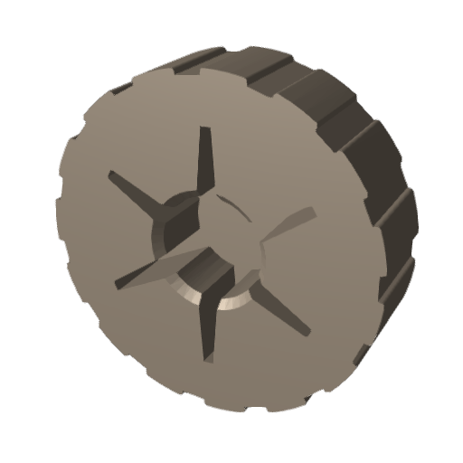](tektronix/awg2020_knob.stl)  
[AWG2020 Control Knob](tektronix/awg2020_knob.stl)

### TM504 / TM500 Series Parts

[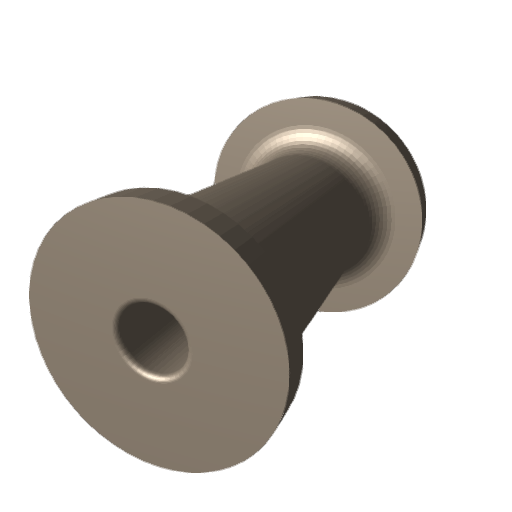](tektronix/back_spacer_tm504.stl)  
[Back Spacer](tektronix/back_spacer_tm504.stl)

  
[Foot](tektronix/foot_tm504.stl)

[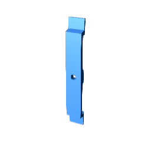](tektronix/side_foot_tm504.stl)  
[Side Foot](tektronix/side_foot_tm504.stl)

[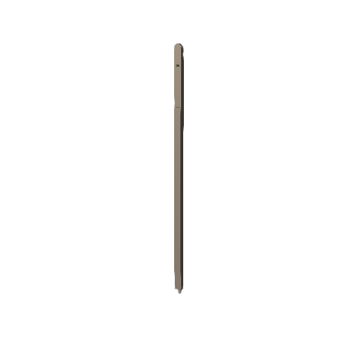](tektronix/slider_tm504.stl)  
[Slider](tektronix/slider_tm504.stl)

### TM500 Support / Covers

[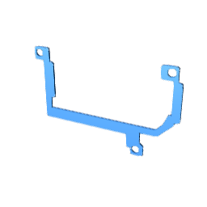](tektronix/support_heatsink.stl)  
[Support Heatsink](tektronix/support_heatsink.stl)

[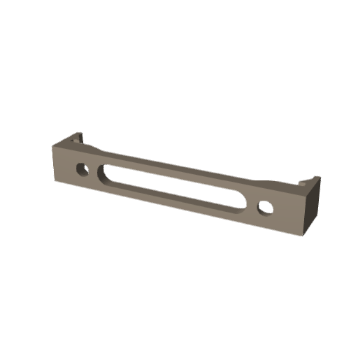](tektronix/support_tm500_flush.stl)  
[Support TM500 (flush)](tektronix/support_tm500_flush.stl)

[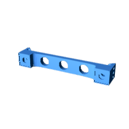](tektronix/support_tm500.stl)  
[Support TM500](tektronix/support_tm500.stl)

  
[TM500 BJT Cover](tektronix/tm500_BJT_cover.stl)

### TM500 Knobs

  
[TM500 Fine Knob 3mm](tektronix/tm500_fine_knob_3mm.stl)

  
[TM500 Fine Line Knob](tektronix/tm500_fine_knob_line_3mm.stl)

[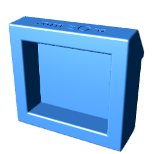](tektronix/tm500_pull_on_power.stl)  
[TM500 Pull-On Power](tektronix/tm500_pull_on_power.stl)

  
[TM500 Switch Coupler](tektronix/tm500_switch_coupler.stl)

### Misc

  
[TO-3 Cover](tektronix/to3_cover.stl)

## Hameg

### Push Button

[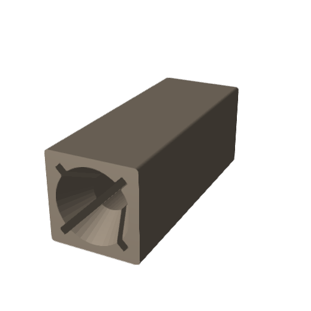](hameg/push_hameg.stl)  
[Push Hameg Button](hameg/push_hameg.stl)

### Coarse Knobs

  
[Coarse Hameg Knob 6.1 mm (open)](hameg/coarse_hameg_knob_6.1mm_open_nut.stl)

  
[Coarse Hameg Knob 6.1 mm](hameg/coarse_hameg_knob_6.1mm.stl)

  
[Coarse Hameg Knob 6 mm](hameg/coarse_hameg_knob_6mm.stl)

### Fine Knobs (Arrow Shape / Dot / Flat / Line variants)

  
[Fine Arrow Hameg 2 mm Knob (D-shaft)](hameg/fine_arrow_hameg_2mm_knob_D.stl)

[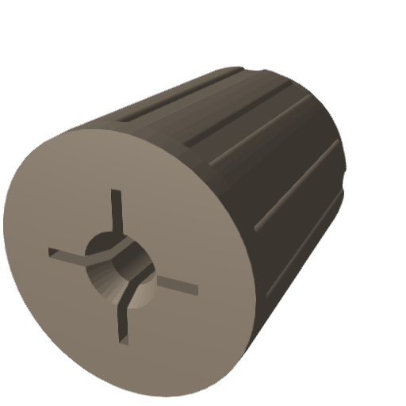](hameg/fine_arrow_hameg_2mm_knob.stl)  
[Fine Arrow Hameg 2 mm Knob](hameg/fine_arrow_hameg_2mm_knob.stl)

[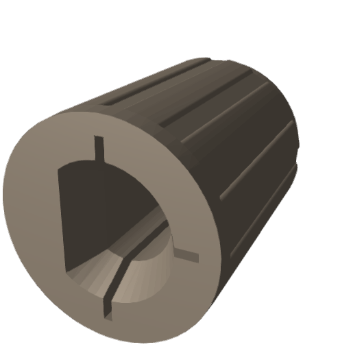](hameg/fine_arrow_hameg_D_knob.stl)  
[Fine Arrow Hameg D-Knob](hameg/fine_arrow_hameg_D_knob.stl)

[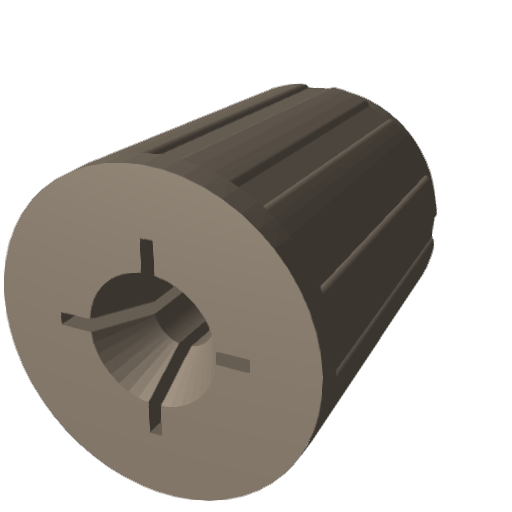](hameg/fine_dot_hameg_2mm_knob.stl)  
[Fine Dot Hameg 2 mm Knob](hameg/fine_dot_hameg_2mm_knob.stl)

[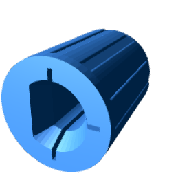](hameg/fine_dot_hameg_D_knob.stl)  
[Fine Dot Hameg D-Knob](hameg/fine_dot_hameg_D_knob.stl)

[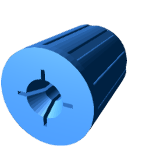](hameg/fine_flat_hameg_2mm_knob.stl)  
[Fine Flat Hameg 2 mm Knob](hameg/fine_flat_hameg_2mm_knob.stl)

  
[Fine Flat Hameg D-Knob](hameg/fine_flat_hameg_D_knob.stl)

  
[Fine Line Hameg 2 mm Knob](hameg/fine_line_hameg_2mm_knob.stl)

  
[Fine Line Hameg D-Knob](hameg/fine_line_hameg_D_knob.stl)

## Metrix

[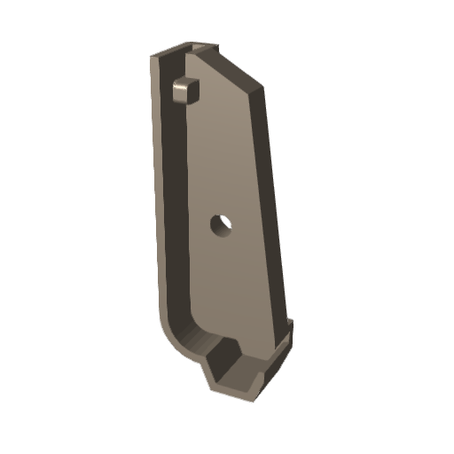](metrix/foot_gx229.stl)  
[Foot GX229](metrix/foot_gx229.stl)
